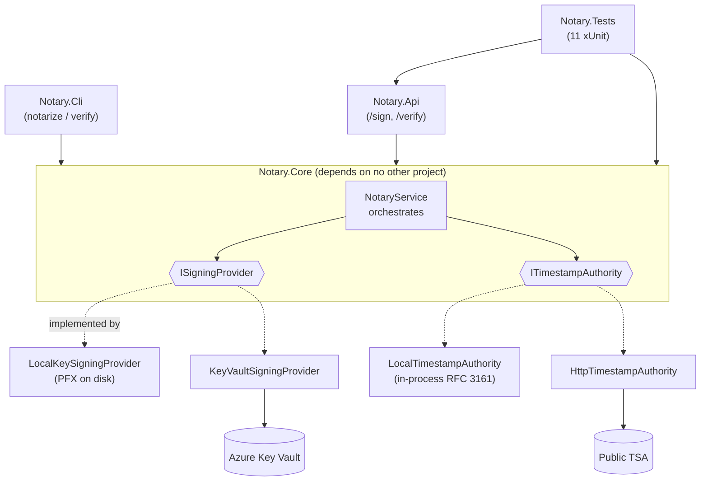
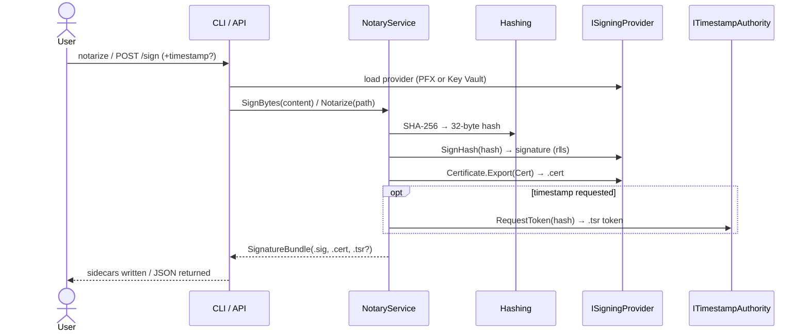
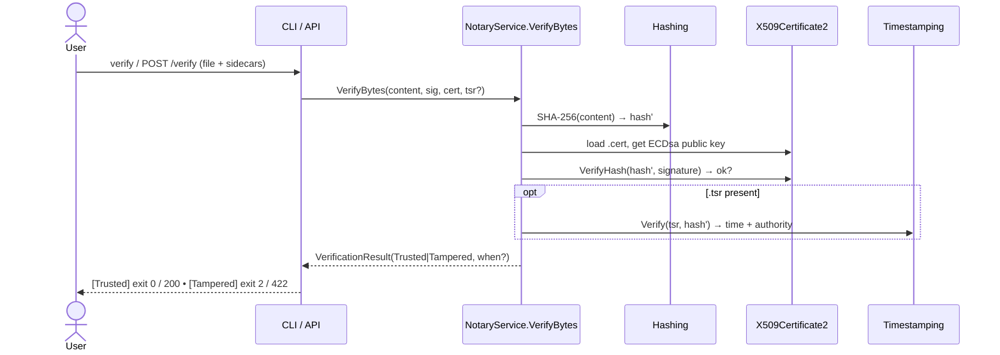

# Personal Notary — The Complete Guide

> One document to **understand** the concepts, **review** the design, **debug** it, **use** it, and **test yourself**.
> Pairs with the top-level [README](../README.md). For the **mathematics and primary sources** behind it,
> see [MATH.md](MATH.md). Diagrams render on GitHub and in VS Code (Markdown Preview Mermaid Support).

## Contents
1. [Is it cleanly structured?](#1-is-it-cleanly-structured)
2. [The concepts (mental models)](#2-the-concepts-mental-models)
3. [Project review (the map)](#3-project-review-the-map)
4. [Debugging guide](#4-debugging-guide)
5. [Using the service (start to finish)](#5-using-the-service-start-to-finish)
6. [Check your understanding](#6-check-your-understanding)
7. [Practice — hands-on exercises](#7-practice--hands-on-exercises)
8. [Glossary](#8-glossary)

> 🎥 **Want the maths + videos?** [MATH.md](MATH.md) has a curated YouTube watch-list (Computerphile,
> 3Blue1Brown, Christof Paar's full course) and pen-and-paper exercises (toy ECDSA, the nonce-reuse break).

---

## 1. Is it cleanly structured?

**Verdict: yes.** It's a small, textbook example of *dependency-inversion / clean layering*.



What makes it clean:

| Principle | How this repo honors it |
|-----------|--------------------------|
| **Dependencies point inward** | `Core` references *no* other project. `Cli`/`Api`/`Tests` depend on `Core`. The graph is acyclic. |
| **One reason to change per file** | Hashing, each provider, each TSA, the orchestrator, and the verifier each live in their own file. |
| **External world hidden behind seams** | Disk, Azure, and HTTP only appear *behind* `ISigningProvider` / `ITimestampAuthority`. `NotaryService` knows none of them. |
| **Policy vs mechanism** | `NotaryService` is the *policy* (hash → sign → verify). *Where the key lives* and *who vouches for time* are swappable *mechanisms*. |
| **Tests mirror the shape** | Unit tests for the core flows, integration tests for the API, a no-op-when-unconfigured live test for Key Vault. |

Where it could be *even* cleaner (from the code review — none are structural):
- The "Key Vault → PFX → fallback" provider-selection ladder is duplicated in `Cli/Program.cs` and `Api/ProviderFactory`. A shared factory in `Core` would remove the drift.
- `HttpTimestampAuthority.RequestToken` is sync-over-async; an `…Async` method on the interface would be the honest shape.
- The SHA-256 OID literal and the self-signed-ECDSA-+-PFX-round-trip ritual appear twice. A tiny `Oids` + `CreateSelfSignedEc` helper would centralize them.

---

## 2. The concepts (mental models)

Read these in order — each builds on the last.

### 2.1 Hashing — a file's fingerprint
`SHA-256` turns any number of bytes into a fixed **32-byte** digest. Two properties power everything else:
- **Deterministic + tiny:** signing a 4 GB file costs the same as a one-liner — you only ever sign 32 bytes.
- **Avalanche / collision-resistant:** flip one bit of the file and the digest changes completely and unpredictably.

➡️ Code: [`Hashing.cs`](../src/Notary.Core/Hashing.cs). The whole system operates on the digest, never the raw file.

### 2.2 Digital signatures — proving *who* and *unchanged*
A key **pair**: a **private** key signs, a **public** key verifies. This project uses **ECDSA on curve P-256**.
- **Sign:** `signature = sign(privateKey, hash)`. For ECDSA the signature is `r‖s` (two numbers; 64 bytes here).
- **Verify:** `verify(publicKey, hash, signature)` → true/false. Anyone with the public key can check it; only the private-key holder could have produced it.

If the file changed, its hash changes, and the old signature no longer matches → **tamper detected**.

➡️ Code: [`LocalKeySigningProvider.SignHash`](../src/Notary.Core/LocalKeySigningProvider.cs) signs; [`NotaryService.VerifyBytes`](../src/Notary.Core/NotaryService.cs) verifies with `ECDsa.VerifyHash`.

### 2.3 X.509 certificates — binding identity to a public key
A raw public key is anonymous. A **certificate** wraps it with an identity (`CN=Jose Rivera Notary`), validity dates, and a signature. Here the cert is **self-signed** (the key vouches for itself) — fine for personal/learning use; in the real world a CA signs it.

➡️ The `.cert` sidecar is the **public** certificate (`Export(X509ContentType.Cert)` — never the private key).

### 2.4 Detached signatures (sidecars) — never touch the original
Instead of embedding the signature inside the document, the notary writes **separate files next to it**:

| File | Holds |
|------|-------|
| `contract.txt` | your original, byte-for-byte untouched |
| `contract.txt.sig` | the 64-byte signature over the hash |
| `contract.txt.cert` | the public X.509 certificate to verify with |
| `contract.txt.tsr` | *(optional)* an RFC 3161 trusted-timestamp token |

### 2.5 Trusted timestamping (RFC 3161) — proving *when*
A signature proves *what* and *who*, but not *when*. A **Time-Stamp Authority (TSA)** is a trusted clock: you send it the hash (the "messageImprint"), it returns a signed token saying "I saw this hash at `genTime`."
- The token (`.tsr`) is a **CMS `SignedData`** wrapping a **`TSTInfo`** structure, signed by a cert carrying the **`timeStamping`** extended-key-usage.
- Verify checks: the TSA's signature is intact **and** the token's messageImprint equals the file's current hash. So tampering breaks the timestamp too.

➡️ Code: [`LocalTimestampAuthority`](../src/Notary.Core/LocalTimestampAuthority.cs) *issues* tokens in-process (offline, deterministic); [`HttpTimestampAuthority`](../src/Notary.Core/HttpTimestampAuthority.cs) calls a real TSA; [`Timestamping.Verify`](../src/Notary.Core/Timestamping.cs) checks them.

### 2.6 Key custody — why the interface takes a *hash*
`ISigningProvider.SignHash(byte[] sha256Hash)` accepts a **precomputed digest**, not the file. That's deliberate: it's exactly what a remote signer (Azure Key Vault / an HSM) expects. You send the 32-byte digest; the vault signs it **server-side** and the private key **never leaves the vault**. Only the digest travels — never your document.

➡️ Code: [`KeyVaultSigningProvider.SignHash`](../src/Notary.Core/KeyVaultSigningProvider.cs) → `CryptographyClient.Sign(ES256, hash)`.

### 2.7 The seams — Dependency Inversion in two interfaces
- **`ISigningProvider`** = "the thing that holds the private key and signs." Local PFX today, Key Vault tomorrow. No method ever exposes the private key — you can *ask it to sign*, not *take the key*.
- **`ITimestampAuthority`** = "a trusted clock that signs a hash + time." In-process today, public TSA tomorrow.

`NotaryService` depends only on these abstractions, so swapping custody or timestamping changes **one class** and nothing else.

---

## 3. Project review (the map)

### 3.1 Projects & responsibilities
| Project | Responsibility |
|---------|----------------|
| `Notary.Core` | Pure domain: hashing, the two seams + their implementations, and `NotaryService`. |
| `Notary.Cli` | `notarize` / `verify` commands; arg parsing; chooses local PFX or Key Vault. |
| `Notary.Api` | ASP.NET Core minimal API: `POST /sign`, `POST /verify`, `/health`. |
| `Notary.Tests` | 11 xUnit tests (unit + in-process API integration). |

### 3.2 `Notary.Core` file-by-file
| File | What it does |
|------|--------------|
| `Hashing.cs` | SHA-256 of bytes/file, hex helper. |
| `ISigningProvider.cs` | The signing seam (`SignHash`, `Certificate`). |
| `LocalKeySigningProvider.cs` | ECDSA P-256 + self-signed cert in a PFX; create/save/load. |
| `KeyVaultSigningProvider.cs` | Signs via Azure Key Vault (`ES256`); key stays in the vault. |
| `ITimestampAuthority.cs` | The timestamping seam (`RequestToken`). |
| `LocalTimestampAuthority.cs` | Issues real RFC 3161 tokens in-process (TSA cert + CMS + ASN.1). |
| `HttpTimestampAuthority.cs` | Requests tokens from a real public TSA over HTTP. |
| `Timestamping.cs` | Decodes & verifies a `.tsr` against a hash; extracts genTime. |
| `NotaryService.cs` | Orchestrates: `SignBytes`/`VerifyBytes` (byte core) + `Notarize`/`Verify` (file wrappers). |

### 3.3 The sign pipeline


### 3.4 The verify pipeline


### 3.5 Test inventory (what each proves)
| Test | Proves |
|------|--------|
| `Notarized_File_Verifies_As_Trusted` | Happy path: sign then verify = Trusted. |
| `Tampered_File_Verifies_As_Tampered` | Change bytes after signing → Tampered. |
| `Notarize_Does_Not_Modify_Original` | Detached: original untouched, sidecars exist. |
| `Saved_And_Reloaded_Key_Still_Verifies` | Key survives a PFX save/load round-trip. |
| `Timestamped_File_Verifies_And_Reports_When` | `.tsr` yields a valid, recent genTime + TSA. |
| `Tampering_Breaks_The_Timestamp_Imprint` | Tamper also invalidates the timestamp imprint. |
| `KeyVault_Provider_Produces_Sidecars_That_Verify` | Real provider path via local-key `CryptographyClient`. |
| `Live_KeyVault_Signs_And_Verifies_When_Configured` | Real Azure round-trip (no-ops unless env vars set). |
| `ApiTests.Sign_Then_Verify_Roundtrips_As_Trusted` | HTTP `/sign` → `/verify` = 200 Trusted. |
| `ApiTests.Verify_Detects_Tampering_With_422` | Tampered file over HTTP = 422 Tampered. |
| `ApiTests.Sign_With_Timestamp_Returns_Tsr_And_Verify_Reports_When` | `.tsr` round-trips over HTTP with a proven time. |

### 3.6 Known findings / hardening backlog (from the code review)
These are **robustness/quality**, not crypto-math errors, and none block a push. Good debugging targets:
1. **`/verify` returns HTTP 500** on a malformed-but-valid-base64 certificate (`VerifyBytes` → `new X509Certificate2(bytes)` throws; not caught). *Fix once in `VerifyBytes` → return `Unverifiable`.*
2. **Thread-safety:** the singleton provider/TSA share one `ECDsa`/key across concurrent `/sign` requests without a lock.
3. `/sign` + DI provider construction aren't wrapped → raw 500 on a bad backend.
4. CLI `--tsa` with the URL omitted → silently un-timestamped, exit 0.
5. API `timestamp` flag is case-sensitive (`True` ≠ `true`).
6. CLI provider not disposed if the timestamper ctor throws (negligible).
7. `LocalTimestampAuthority` leaks the intermediate self-signed cert (one-time).

---

## 4. Debugging guide

### 4.1 Run / debug one test
```powershell
# run a single test by name fragment
dotnet test --filter "FullyQualifiedName~Timestamped_File_Verifies"
# run a whole class
dotnet test --filter "FullyQualifiedName~ApiTests"
```

### 4.2 VS Code F5 setup
Install **C# Dev Kit**. Then either use the Testing panel's *Debug Test* (gutter ▶ icon), or add `.vscode/launch.json`:
```jsonc
{
  "version": "0.2.0",
  "configurations": [
    {
      "name": "Run API",
      "type": "coreclr",
      "request": "launch",
      "preLaunchTask": "build",
      "program": "${workspaceFolder}/src/Notary.Api/bin/Debug/net8.0/Notary.Api.dll",
      "env": { "ASPNETCORE_URLS": "http://localhost:5080" },
      "serverReadyAction": { "pattern": "Now listening on:\\s+(https?://\\S+)" }
    }
  ]
}
```

### 4.3 Where to set breakpoints (by concept)
| To watch… | Breakpoint at… |
|-----------|----------------|
| the hash being computed | `Hashing.Sha256` |
| the signature being produced | `LocalKeySigningProvider.SignHash` (or `KeyVaultSigningProvider.SignHash`) |
| the verify decision | `NotaryService.VerifyBytes`, the `pub.VerifyHash(...)` line |
| an RFC 3161 token being **built** | `LocalTimestampAuthority.RequestToken` |
| a `.tsr` being **checked** | `Timestamping.Verify` |
| the HTTP path | `ApiTests.Sign_Then_Verify_Roundtrips_As_Trusted`, then step into the handlers |

### 4.4 Guided exercise — reproduce & fix finding #1 (the 500)
1. Start the API: `dotnet run --project src/Notary.Api --urls http://localhost:5080`.
2. Send a file with a **valid-base64 but bogus** certificate:
   ```powershell
   "hi" | Set-Content junk.txt -NoNewline
   curl.exe -s -o out.json -w "%{http_code}" -X POST http://localhost:5080/verify `
     -F file=@junk.txt -F "signature=AAAA" -F "certificate=aGVsbG8="
   ```
   You'll see **500** (the bytes decode fine, but `new X509Certificate2(...)` throws).
3. Open [`NotaryService.VerifyBytes`](../src/Notary.Core/NotaryService.cs). Wrap the cert load in a `try/catch (CryptographicException)` and return `new(VerificationStatus.Unverifiable, null, "Certificate could not be read.")`.
4. Re-run → now a clean **422**. Add a test asserting that. ✔️

### 4.5 Inspecting the artifacts by hand
```powershell
# the .cert is a DER X.509 — dump it
certutil -dump .\contract.txt.cert
# the .tsr is a DER CMS/PKCS#7 timestamp token
certutil -asn .\contract.txt.tsr | Select-String "genTime|messageImprint" -Context 0,1
# the .sig is raw 64-byte ECDSA r||s
(Get-Item .\contract.txt.sig).Length    # 64
```

---

## 5. Using the service (start to finish)

### 5.1 CLI
```powershell
# 1) create a document
"I, Jose Rivera, agree to deliver on 2026-06-20." | Set-Content contract.txt -NoNewline
# 2) notarize (first run also creates notary-key.pfx) — add a trusted timestamp
dotnet run --project src/Notary.Cli -- notarize ./contract.txt --timestamp
# 3) verify → [Trusted] ... timestamped: ...
dotnet run --project src/Notary.Cli -- verify ./contract.txt
# 4) tamper one byte, verify again → [Tampered] (exit code 2)
```

### 5.2 API (local)
```powershell
dotnet run --project src/Notary.Api --urls http://localhost:5080
# sign (returns base64 signer/signature/certificate/timestamp)
curl.exe -s -F file=@contract.txt -F timestamp=true http://localhost:5080/sign
# verify (200 Trusted / 422 Tampered) — pass the base64 fields back
```

### 5.3 Docker
```powershell
docker build -t notary-api .
docker run -p 8088:8080 notary-api          # ephemeral dev key
# mount a real key:  -v C:\keys:/keys -e NOTARY_KEY_PATH=/keys/notary-key.pfx -e NOTARY_KEY_PASS=...
```

### 5.4 Real Azure Key Vault
```powershell
az login
$env:NOTARY_KEYVAULT_URI = "https://my-vault.vault.azure.net"
$env:NOTARY_KEYVAULT_CERT = "notary"
dotnet run --project src/Notary.Cli -- notarize ./contract.txt --keyvault $env:NOTARY_KEYVAULT_URI --cert notary
# the private key never leaves the vault; verify is unchanged (it only needs the public .cert)
```

---

## 6. Check your understanding

Try to answer before expanding. Levels: 🟢 recall · 🟡 apply · 🔴 design.

1. 🟢 Why can the notary sign a 4 GB file as cheaply as a one-line file?
2. 🟢 Which sidecar would you hand a colleague so they can verify, and which must you *never* share?
3. 🟡 You change one byte of a notarized file. Exactly which check fails first in `VerifyBytes`, and why?
4. 🟡 `verify` is a `static` method but `notarize` is not. What does that asymmetry tell you about what each needs?
5. 🟡 The `.sig` proves *what* and *who*. What does the `.tsr` add, and what does it bind to so that tampering also breaks it?
6. 🔴 Why does `ISigningProvider.SignHash` take a **hash** instead of the file or raw bytes? What future does that choice enable?
7. 🔴 To move from a local PFX to Azure Key Vault, how many classes change, and which one? Why is the verifier untouched?
8. 🟡 `KeyVaultSigningProvider` and `LocalKeySigningProvider` produce signatures the *same* `ECDsa.VerifyHash` accepts. What property of the signature format makes that work?
9. 🔴 The API registers `ISigningProvider` as a singleton. Name a concurrency hazard that introduces and one way to remove it.
10. 🟡 A client posts `timestamp=True` and gets an un-timestamped result with HTTP 200. Why, and where's the one-line fix?
11. 🔴 Sketch how you'd add a third custody backend (say, a YubiKey/PKCS#11 HSM) with minimal change. Which seam, which method?
12. 🟢 What makes the `LocalTimestampAuthority`'s certificate a *Time-Stamp Authority* cert specifically (vs the signing cert)?

<details>
<summary><b>Answer key</b></summary>

1. The system only ever signs the 32-byte SHA-256 **digest**, never the file bytes — so signing cost is independent of file size.
2. Share `.cert` (public certificate); also `.sig`/`.tsr`. Never share `notary-key.pfx` (it holds the **private** key).
3. The signature check: `pub.VerifyHash(hash', signature)` returns false, because `hash'` (recomputed now) differs from the hash that was signed → `Tampered`.
4. Verifying needs only **public** material (`.sig`/`.cert`/`.tsr`), so it can be `static` with no key/provider. Signing needs the **private key**, so it needs a provider instance.
5. The `.tsr` adds *when* (a trusted timestamp). It's an RFC 3161 token whose **messageImprint** is the document's hash, so altering the file breaks both the signature and the timestamp imprint.
6. A hash is exactly what a remote signer (Key Vault/HSM) signs — only the 32-byte digest crosses the boundary, never the document, and the key can stay remote. It future-proofs the seam for HSM-backed custody.
7. **One** class: add `KeyVaultSigningProvider : ISigningProvider`. `NotaryService` and `VerifyBytes` depend only on the interface and on the **public** certificate, so verification is identical regardless of where the private key lived.
8. Both emit the **IEEE-P1363 fixed-size `r‖s`** format (ES256 in Key Vault, `SignHash` default locally), which is what `ECDsa.VerifyHash` expects by default.
9. Two concurrent `/sign` requests share one `ECDsa` instance, which isn't guaranteed thread-safe → sporadic exceptions/corrupt signatures. Fixes: lock around `SignHash`, or register the provider per-scope, or document single-threaded use.
10. The check is `t == "true" || t == "1"` (case-sensitive); `"True"` (what `bool.ToString()` emits) fails it. One-line fix: compare case-insensitively (e.g. `bool.TryParse` or `string.Equals(..., OrdinalIgnoreCase)`).
11. Implement `ISigningProvider` (e.g. `Pkcs11SigningProvider`) whose `SignHash` calls the HSM and whose `Certificate` returns the public cert. Wire it into the CLI/API provider selection. Nothing else changes.
12. Its certificate carries the **`timeStamping`** extended-key-usage (OID `1.3.6.1.5.5.7.3.8`), marked **critical**, per RFC 3161 §2.3 — the verifier requires it before trusting the token.

</details>

---

## 7. Practice — hands-on exercises

Each has a **goal**, a **do**, and a **checkpoint** you can verify yourself. 🟢 warm-up · 🟡 build · 🔴 stretch.

**P1 🟢 — Notarize, tamper, restore.**
*Do:* `notarize ./contract.txt --timestamp`, then `verify` (Trusted), flip one byte, `verify` (Tampered), flip it back, `verify`.
*Checkpoint:* you can state which of the `.sig`/`.cert`/`.tsr` changed (none — they're detached) and why the verdict flipped.

**P2 🟢 — Look inside the sidecars.**
*Do:* `(Get-Item contract.txt.sig).Length`; `certutil -dump contract.txt.cert`; `certutil -asn contract.txt.tsr`.
*Checkpoint:* the `.sig` is **64 bytes** (P-256 $r\,\|\,s$); you can find `CN=…` in the cert and the `genTime` in the `.tsr`.

**P3 🟡 — Reproduce & fix the `/verify` 500.**
*Do:* follow §4.4 — post a valid-base64-but-bogus certificate, see the 500, then guard the cert load in `VerifyBytes` and return `Unverifiable`.
*Checkpoint:* the same request now returns a clean **422**; add a test that asserts it.

**P4 🟡 — Swap the hash to SHA-384 and watch what breaks.**
*Do:* change `Hashing` to SHA-384 (48-byte digest) but leave the key on P-256/ES256.
*Checkpoint:* signing/verifying now mismatches — explain *why* (ES256 expects a 32-byte digest; a 48-byte hash needs P-384/ES384). This is the **hash-size ↔ curve-size** lesson, felt directly.

**P5 🔴 — Make the signer thread-safe (review finding #2).**
*Do:* write a test that fires many `SignBytes` calls concurrently against one shared provider; observe flakiness; add a `lock` (or register the provider per-scope); re-run.
*Checkpoint:* the concurrent test is green and you can explain why a singleton `ECDsa` needed protection.

**P6 🔴 — Use a real TSA.**
*Do:* point `HttpTimestampAuthority` at a public RFC 3161 TSA (e.g. `http://timestamp.digicert.com`) via `--tsa`, notarize, then `verify`.
*Checkpoint:* the `.tsr` verifies and `certutil -asn` shows a real authority's `genTime`; contrast it with the in-process `LocalTimestampAuthority`.

**Stretch 🔴 — Batch notarization with a Merkle tree.** Hash many files into a Merkle tree, sign only the
**root**, and store each file's inclusion proof. One signature notarizes thousands of files — and you've
just rebuilt the core idea behind Certificate Transparency and blockchains.

## 8. Glossary
| Term | Meaning |
|------|---------|
| **SHA-256** | Hash function producing a 32-byte digest (the file's fingerprint). |
| **ECDSA / P-256** | Elliptic-curve digital-signature algorithm on the NIST P-256 curve. |
| **r‖s (IEEE P1363)** | The fixed-size concatenation format of an ECDSA signature (64 bytes for P-256). |
| **X.509 certificate** | A signed binding of a public key to an identity + validity period. |
| **Detached signature** | A signature stored *beside* the data, not embedded in it. |
| **RFC 3161 / TSA** | Standard for trusted timestamps; a Time-Stamp Authority signs `hash + time`. |
| **TSTInfo** | The structure inside a timestamp token: messageImprint, genTime, serial, policy. |
| **CMS / PKCS#7 `SignedData`** | Cryptographic Message Syntax container; the `.tsr` token is one. |
| **ESSCertIDv2** | A signed attribute pinning which certificate signed the timestamp. |
| **`timeStamping` EKU** | Extended-key-usage OID `1.3.6.1.5.5.7.3.8` that marks a cert as a TSA cert. |
| **Key Vault / HSM** | Managed/hardware key store where the private key never leaves; it signs on your behalf. |
| **`DefaultAzureCredential`** | Azure auth that tries env vars → managed identity → `az login` → IDE, no secrets in code. |
| **Seam** | An interface that lets you swap an implementation without touching callers. |
